# Books Service

Express + TypeScript + Prisma CRUD API for managing books.

## Tech Stack

- Runtime: Node.js + Express
- Language: TypeScript
- ORM: Prisma
- DB: PostgreSQL
- Validation: Zod

## Features

- Create / Read / Update / Delete books
- List books with pagination & filters (title, author)
- Input validation with expressive error responses
- Structured error handling
- Seed script for sample data

## Getting Started

### 1. Prerequisites

- Node.js >= 18
- PostgreSQL running locally (or accessible remotely)

### 2. Clone & Install

```bash
npm install
```

### 3. Environment Variables

Copy the example file and adjust if needed:

```bash
cp .env.example .env
```

Variables:

- `DATABASE_URL` – Postgres connection string (already set for local default)
- `PORT` – API port (default 3000)

### 4. Database Setup

Run migrations (will create the DB schema if not present):

```bash
npx prisma migrate dev --name init
```

Open Prisma Studio (optional UI):

```bash
npx prisma studio
```

### 5. Seed Data (optional)

```bash
npm run seed
```

### 6. Run in Development

```bash
npm run dev
```

Server starts on: `http://localhost:3000`

### 7. Build & Run Production Build

```bash
npm run build
npm start
```

## API Endpoints

Base URL: `/`

Health check:

- `GET /health` → `{ status: "ok" }`

### Screenshots / Examples

Below sections reserved for screenshots you will capture from Swagger UI

#### 1. Health Check

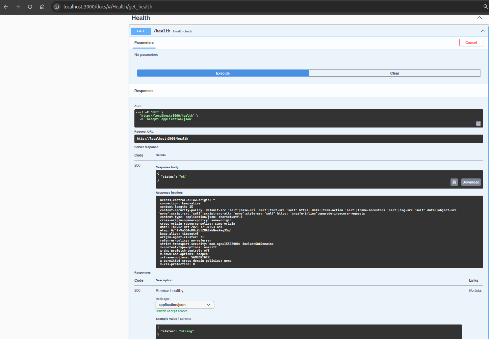
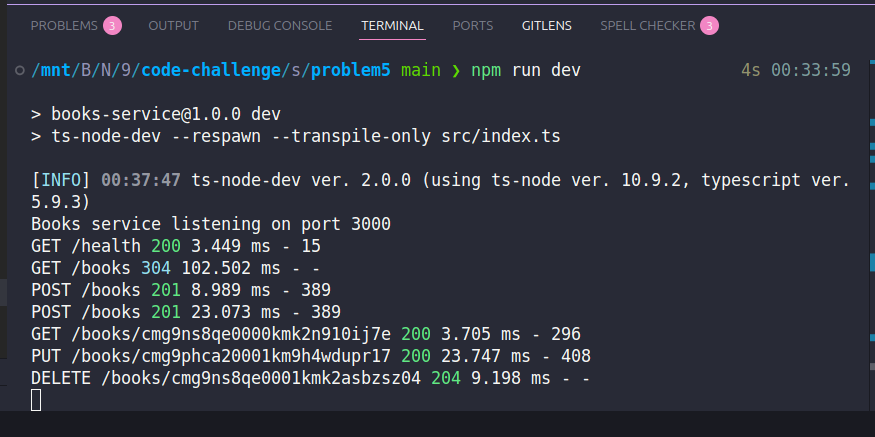

#### 2. List Books

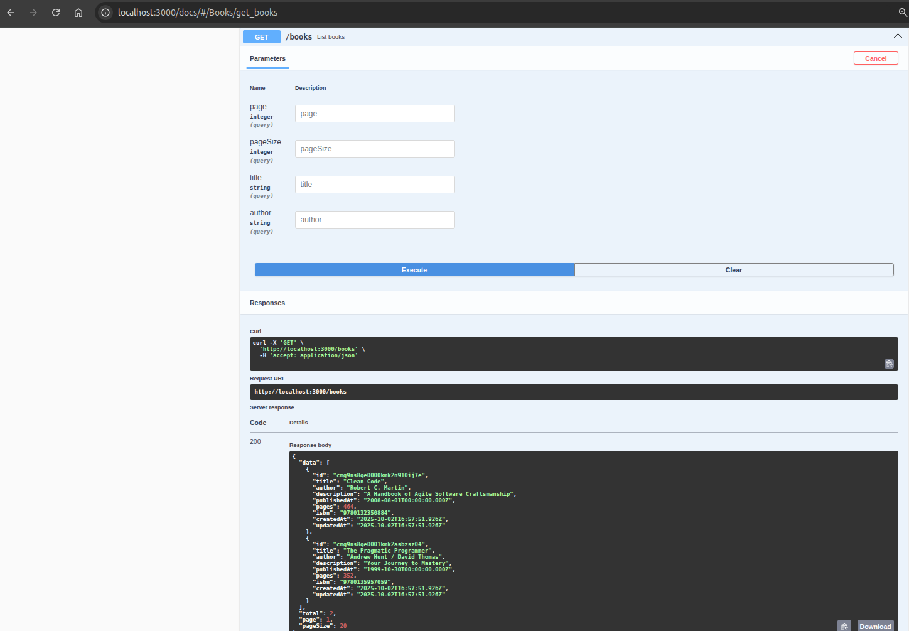
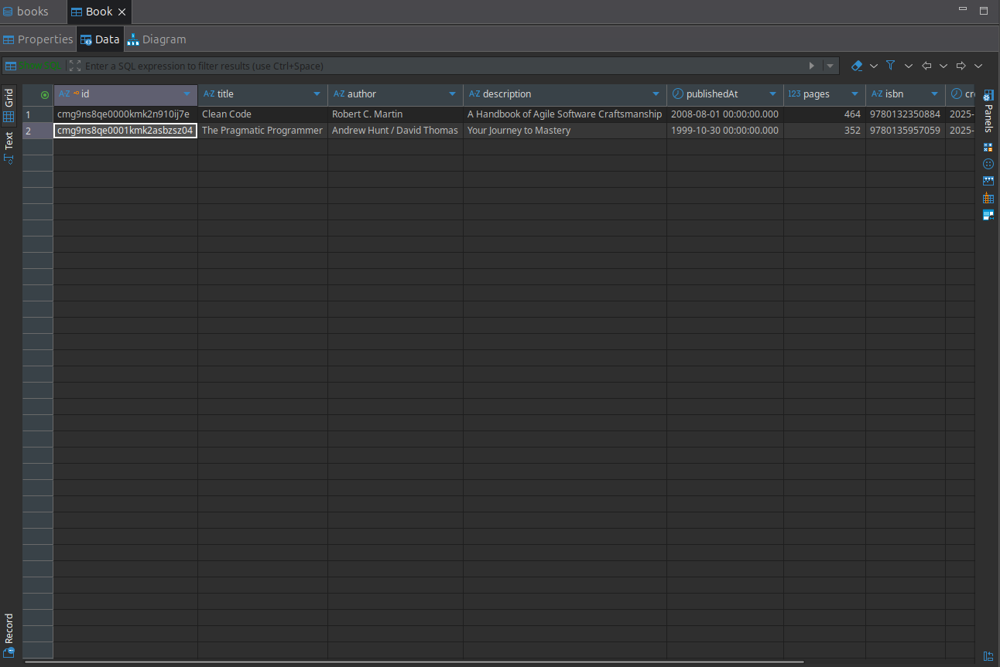

#### 3. Create a Book

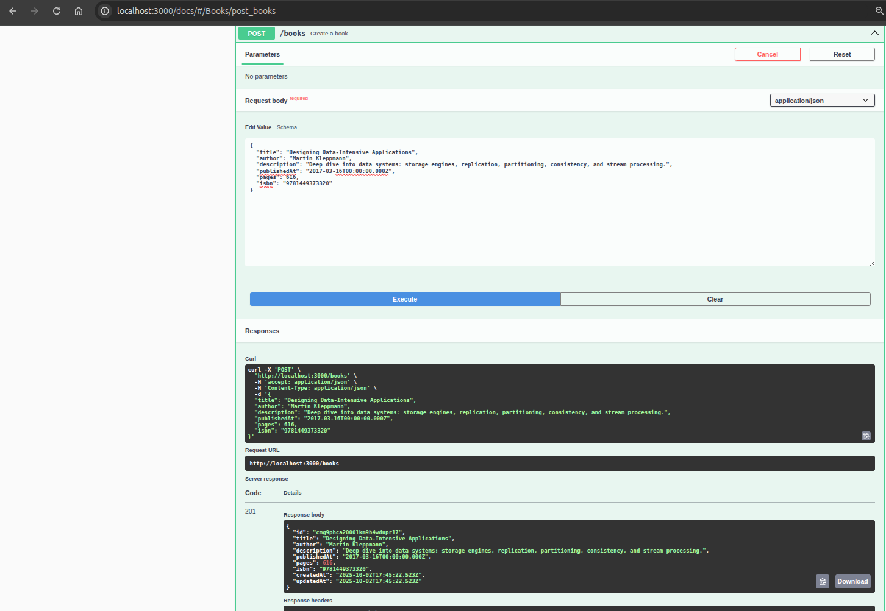
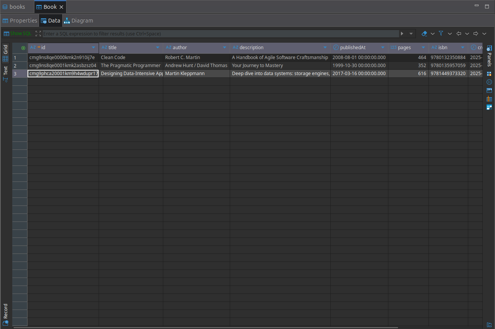

#### 4. Get Book By ID

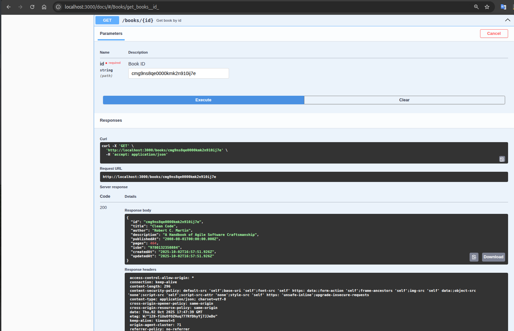
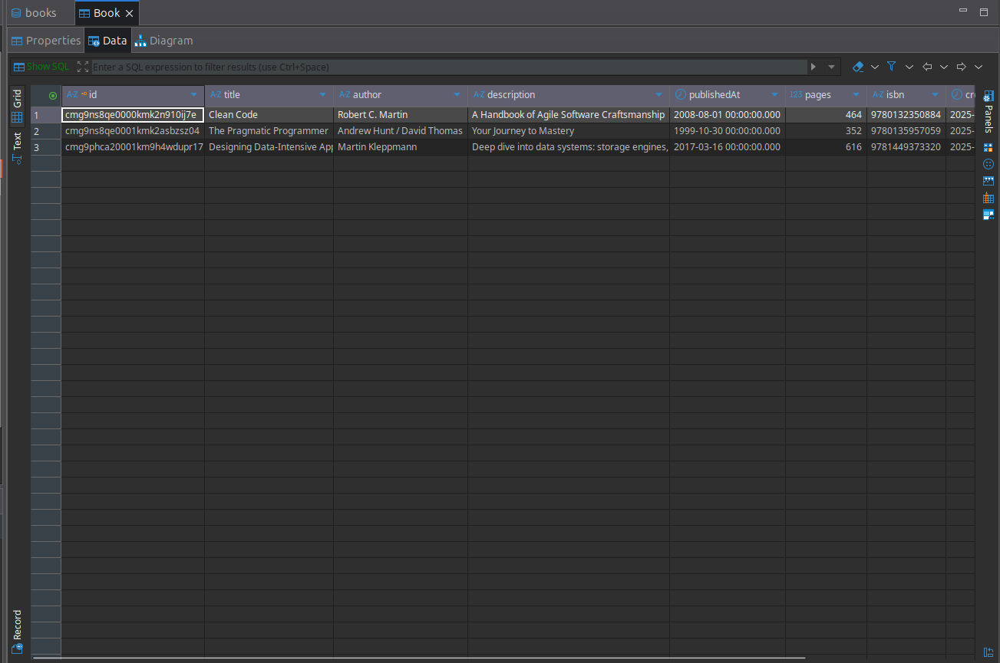

#### 5. Update Book

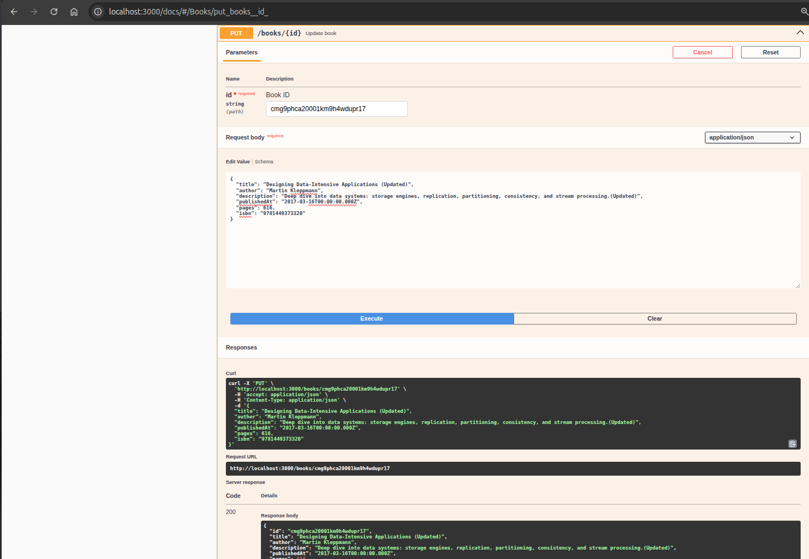
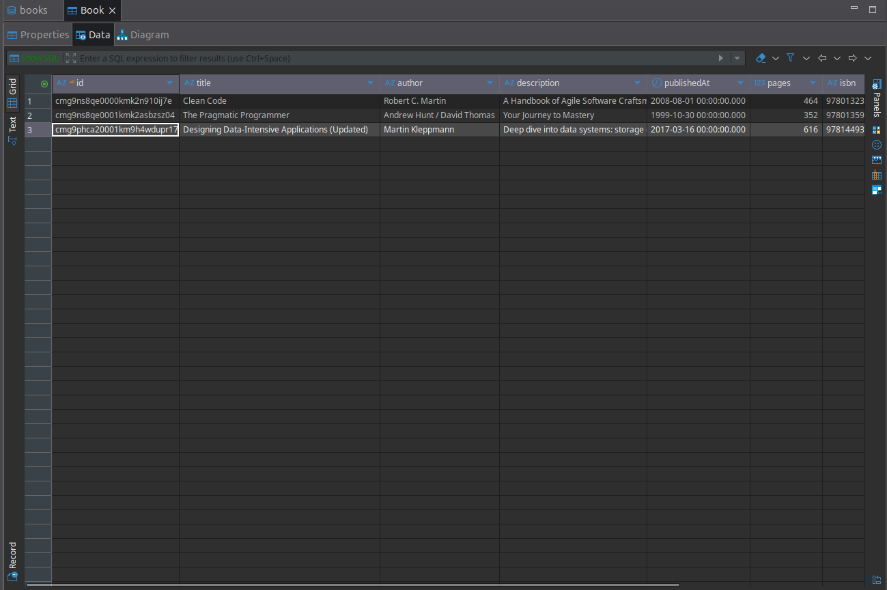

#### 6. Delete Book

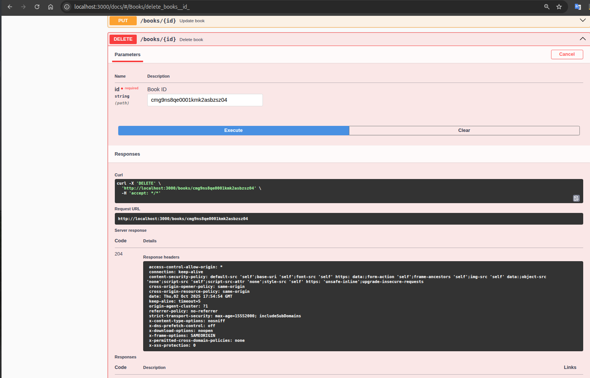
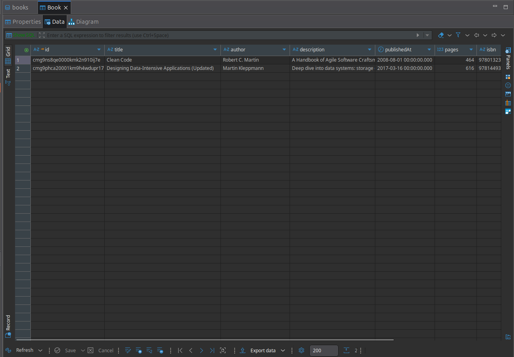

### Create Book

`POST /books`

```json
{
  "title": "Clean Architecture",
  "author": "Robert C. Martin",
  "description": "On software design",
  "publishedAt": "2017-09-20T00:00:00.000Z",
  "pages": 300,
  "isbn": "9780134494166"
}
```

Responses:

- 201 Created + book JSON
- 400 Validation error

### List Books

`GET /books?title=clean&author=martin&page=1&pageSize=10`

Query Params:

- `title` (optional, substring match, case-insensitive)
- `author` (optional, substring match, case-insensitive)
- `page` (default 1)
- `pageSize` (default 20, max 100)

Response:

```json
{
  "data": [{ "id": "...", "title": "..." }],
  "total": 2,
  "page": 1,
  "pageSize": 10
}
```

### Get Book By ID

`GET /books/:id`

- 200 + book
- 404 if not found

### Update Book

`PUT /books/:id`
Body: any subset of create fields.

- 200 + updated book
- 404 if not found
- 400 validation error

### Delete Book

`DELETE /books/:id`

- 204 No Content
- 404 if not found

## Validation Rules

- `title` / `author` required (create)
- `publishedAt` ISO datetime string
- `pages` positive integer
- `isbn` min length 5 (unique if provided)

## Project Structure

```
src/
	index.ts        # Server bootstrap
	app.ts          # Express app configuration
	routes/         # Route definitions
	controllers/    # Request handlers (validation + mapping)
	services/       # Business logic & DB access via Prisma
	validators/     # Zod schemas
	middleware/     # Error handling, etc
prisma/
	schema.prisma   # Prisma data model
	seed.ts         # Seed script
```

## Common Tasks

| Task                   | Command                  |
| ---------------------- | ------------------------ |
| Install deps           | `npm install`            |
| Generate Prisma client | `npx prisma generate`    |
| Run migrations         | `npm run prisma:migrate` |
| Open Prisma Studio     | `npm run prisma:studio`  |
| Seed data              | `npm run seed`           |
| Dev server             | `npm run dev`            |
| Build                  | `npm run build`          |
| Start prod             | `npm start`              |

## Error Format

Validation error:

```json
{
  "message": "Validation error",
  "issues": [{ "path": ["title"], "message": "Required" }]
}
```

Not found:

```json
{ "message": "Book not found" }
```

Generic:

```json
{ "message": "Internal Server Error" }
```

## OpenAPI / Swagger Docs

Interactive documentation is served at:

`GET /docs` (Swagger UI)

Raw spec:

`GET /openapi.json`

Export spec to a local file (generates `openapi.json` in project root):

```bash
npm run openapi:export
```

You can then import `openapi.json` into tools like Postman, Insomnia, or Stoplight.

## Notes

- Prisma client generation happens automatically on install; run `npx prisma generate` if schema changes.
- Use `DATABASE_URL` to point to a different Postgres instance (e.g. Docker container).
