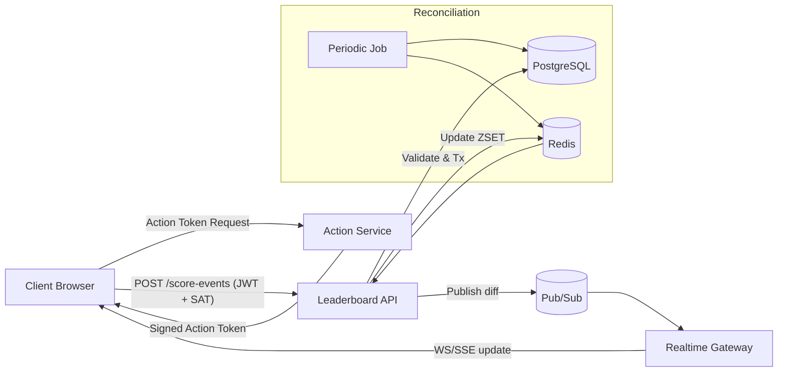
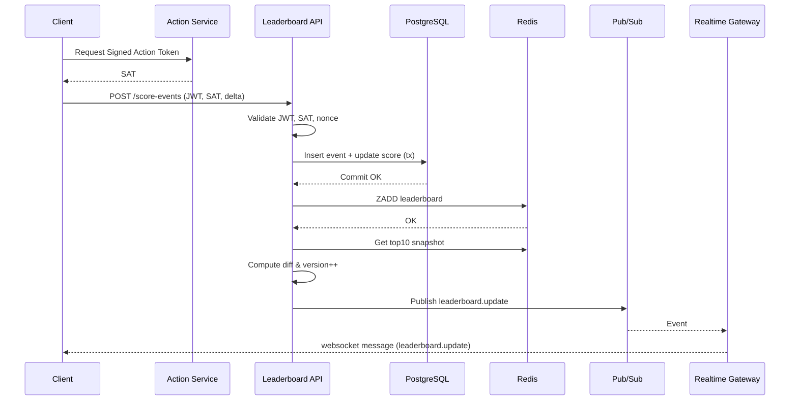

# Realtime Leaderboard Module Specification

## 1. Overview

A backend service module that maintains and serves a realtime leaderboard of the top 10 user scores for display on a public (or semi-public) website. Users perform an abstract **Action** (business-defined elsewhere) that results in an increment to their score. The system must:

- Persist user scores reliably.
- Update the global top 10 ranking with low latency (< 1s target P50, < 2s P95 end-to-end from action completion to UI update).
- Defend against fraudulent score inflation attempts.
- Scale horizontally under bursty write loads.

## 2. Goals

- Provide consistent, fast read access to top 10 scores.
- Support high write throughput (score increment events).
- Realtime push updates to connected clients when leaderboard changes.
- Strong security controls to prevent unauthorized score changes.
- Observability for correctness and performance.

## 3. Non-Goals

- Implementing the user Action itself (business logic outside scope).
- Long-term analytics or historical trend visualization (can be future work).
- Complex matchmaking/game session semantics.
- Providing a full user profile service (only score-related data needed here).

## 4. Key Requirements Mapping

| Requirement                 | Spec Section                                         |
| --------------------------- | ---------------------------------------------------- |
| Show top 10 scores          | API: `GET /leaderboard/top` & Data Model & Caching   |
| Live update scoreboard      | Realtime Updates (WebSocket/SSE) & Pub/Sub Flow      |
| Increment score via action  | `POST /score-events` endpoint & Processing Pipeline  |
| Secure score increases      | Security & Anti-Abuse sections                       |
| Prevent malicious tampering | Signed Action Tokens, Rate Limits, Anomaly Detection |

## 5. High-Level Architecture

Components:

1. **API Gateway / Edge** – Auth, rate limiting, WAF.
2. **Leaderboard Service** – Core module (this spec): REST + WebSocket/SSE endpoint, business validation.
3. **Score Processor** – Idempotent consumer applying ScoreEvents (could be same service for MVP or separated into background worker for scaling).
4. **Datastores**:
   - Primary DB (e.g., PostgreSQL) for authoritative `user_scores` & immutable `score_events` audit log.
   - Redis (or Elasticache / KeyDB) for realtime leaderboard sorted set and user score cache.
5. **Pub/Sub Bus** (e.g., Redis Pub/Sub, NATS, or Kafka) for broadcasting leaderboard delta events to web tier.
6. **Realtime Gateway** – Manages WebSocket/SSE fan-out to clients; subscribes to leaderboard change topics.
7. **Security & Anti-Fraud Subsystems** – Token verification, rate limiting, anomaly heuristics, optional ML pipeline (future).
8. **Observability Stack** – Metrics (Prometheus), Logs (structured), Traces (OpenTelemetry).

### Data Flow Summary

Action Completed -> Client obtains Signed Action Token -> `POST /score-events` -> Validation -> Persist event & update user score (DB Tx) -> Update Redis sorted set -> If leaderboard changed OR user's presence in top 10 changed -> Publish `leaderboard.update` -> Realtime gateway pushes to subscribed clients -> UI updates scoreboard.

## 6. Data Model

### Entities

- `User` (external system authoritative; minimal fields mirrored locally):
  - `id` (UUID or ULID)
  - `display_name` (optional cache)
- `ScoreEvent` (append-only):
  - `id` (ULID for time-ordered uniqueness)
  - `user_id`
  - `delta` (int > 0)
  - `action_type` (string enum; optional; aids anomaly detection)
  - `signature_id` / `action_token_id` (for traceability)
  - `created_at` (timestamp)
  - `ingested_at` (timestamp)
  - `client_metadata` (JSONB: ip_hash, device_id, app_version)
- `UserScore` (current aggregate):
  - `user_id` (PK, FK)
  - `score` (bigint, default 0)
  - `updated_at`

### Relational Schema (PostgreSQL-esque)

```sql
CREATE TABLE user_scores (
  user_id UUID PRIMARY KEY,
  score BIGINT NOT NULL DEFAULT 0,
  updated_at TIMESTAMPTZ NOT NULL DEFAULT now()
);

CREATE TABLE score_events (
  id TEXT PRIMARY KEY, -- ULID
  user_id UUID NOT NULL REFERENCES user_scores(user_id),
  delta INT NOT NULL CHECK (delta > 0 AND delta < 1000000),
  action_type TEXT NOT NULL,
  action_token_id TEXT NOT NULL,
  created_at TIMESTAMPTZ NOT NULL DEFAULT now(),
  ingested_at TIMESTAMPTZ NOT NULL DEFAULT now(),
  client_metadata JSONB
);

CREATE INDEX idx_score_events_user_created ON score_events(user_id, created_at DESC);
CREATE INDEX idx_score_events_created ON score_events(created_at);
```

### Caching / Leaderboard Structure

Redis Sorted Set: `leaderboard:global` with `score` as the ZSET score and `user_id` as member.

- Additional key: `user:score:{user_id}` (string or hash) for quick lookups; TTL optional (or persistent, updated on writes).
- Maintain a cached snapshot JSON: `leaderboard:top10:json` (with ETag/version) for ultra-fast GET.
- Version key: `leaderboard:version` (incremented on each material change to top 10 ordering or membership).

### Consistency

- DB is source of truth; Redis is a **write-through cache**.
- Score updates in a DB transaction followed by Redis update (with retry & reconciliation job).
- Periodic reconciliation (cron) recomputes top 10 from DB to detect divergence.

## 7. API Design

All responses use JSON. Errors return problem+json style.

### 7.1 Authentication

- Bearer JWT (user identity) from upstream identity provider.
- `POST /score-events` additionally requires a short-lived (<=30s) **Signed Action Token** header: `X-Action-Token`.

### 7.2 Endpoints

1. `GET /leaderboard/top`

   - Description: Returns top 10 users with scores and version.
   - Query Params: `ifNoneMatch` via HTTP `If-None-Match` header for caching.
   - Response 200:
     ```json
     {
       "version": 1234,
       "generated_at": "2025-10-03T12:00:00Z",
       "entries": [
         {"rank":1, "user_id":"...", "score":12345, "display_name":"Alice"},
         ... up to 10
       ]
     }
     ```
   - 304 if unchanged.

2. `GET /users/{id}/score`

   - Desc: Returns a user's current score.
   - Response 200:
     ```json
     { "user_id": "...", "score": 12345, "updated_at": "2025-10-03T12:00:00Z" }
     ```
   - 404 if user unknown.

3. `POST /score-events`
   - Desc: Submit a score increment event.
   - Headers: `Authorization: Bearer <JWT>`, `X-Action-Token: <opaque>`
   - Body:
     ```json
     {
       "delta": 25,
       "action_type": "level_complete",
       "client_metadata": { "device_id": "hash123" }
     }
     ```
   - Idempotency Key (recommended) via `Idempotency-Key` header referencing action token id.
   - Response 202 (async) or 200 (sync) depending on mode:
     ```json
     {
       "event_id": "01H...",
       "new_score": 12400,
       "user_id": "...",
       "leaderboard_changed": true
     }
     ```
   - Errors: 400 (validation), 401 (unauth), 403 (invalid token), 409 (duplicate), 429 (rate limit), 422 (suspicious flagged), 500.

### 7.3 Realtime Channel

- WebSocket endpoint: `wss://api.example.com/realtime` or SSE: `GET /leaderboard/stream` (choose one; both documented for flexibility).
- Client subscribes to `leaderboard.global.top10`.
- Message (on change only):
  ```json
  {
    "type":"leaderboard.update",
    "version":1235,
    "diff": {
      "removed": ["user_id_old"],
      "added": [{"rank":7,"user_id":"...","score":9000}],
      "moved": [{"user_id":"...","old_rank":5,"new_rank":3}]
    },
    "full": {"entries":[ ... top 10 ... ]}
  }
  ```
- Heartbeat every 25s: `{ "type": "ping", "ts": 1696345234 }`
- Close codes: 4001 (auth), 4009 (rate limited), 4010 (protocol error).

## 8. Processing & Update Flow

1. Client completes Action -> obtains Signed Action Token (SAT) from separate Action Service (proof-of-action: includes user_id, action_type, nonce, exp, HMAC).
2. Client calls `POST /score-events` with SAT & JWT.
3. Service validates JWT, SAT signature, expiry, nonce uniqueness.
4. Begin DB transaction:
   - Upsert row in `user_scores` if absent (initial score 0).
   - Insert `score_events` (id = ULID or derived from SAT nonce for idempotency).
   - Update `user_scores.score = score + delta`.
5. Commit.
6. Update Redis: `ZADD leaderboard:global <score> <user_id>` & set `user:score:{id}`.
7. Retrieve new top 10; compare with cached snapshot. If changed:
   - Increment `leaderboard:version`.
   - Publish `leaderboard.update` with diff payload.
   - Update `leaderboard:top10:json`.
8. Realtime gateway pushes to clients.
9. (Async) Anomaly heuristics evaluated; potential flag triggers additional monitoring.

## 9. Security & Anti-Abuse

| Aspect              | Mechanism                                                                                                                          |
| ------------------- | ---------------------------------------------------------------------------------------------------------------------------------- |
| Authentication      | JWT (aud, iss, exp validated)                                                                                                      |
| Action authenticity | Signed Action Token (HMAC or ECDSA) containing user_id, action_type, nonce, exp, delta_cap. Server recomputes & verifies.          |
| Authorization       | Ensure JWT.sub == SAT.user_id; enforce per-action delta <= SAT.delta_cap.                                                          |
| Idempotency         | SAT.nonce or `Idempotency-Key` stored in Redis set: `scoreevent:nonce:{nonce}` with TTL to prevent replay.                         |
| Rate Limiting       | Token bucket at user + IP (e.g., 60 score events/min). Edge + service-level.                                                       |
| Input Validation    | `delta` integer bounds, action_type enumeration.                                                                                   |
| Anomaly Detection   | Heuristics: z-score of deltas/time; sudden large jumps; device diversity; per-hour cap. Flag -> throttle or require manual review. |
| Transport Security  | TLS 1.2+; HSTS.                                                                                                                    |
| Replay Protection   | Nonce uniqueness, short SAT expiry (<30s).                                                                                         |
| Logging & Audit     | Immutable score_events table; structured logs with correlation IDs.                                                                |
| Secret Management   | Keys rotated via KMS; maintain key version in SAT header `kid`.                                                                    |

### Signed Action Token Format (Example JWT-like but internal)

Header: `{ "alg":"HS256", "typ":"SAT", "kid":"v3" }`
Payload:

```json
{
  "sub": "<user_id>",
  "act": "level_complete",
  "nonce": "01HABCDXYZ...",
  "delta_cap": 50,
  "exp": 1696345234
}
```

Signature: `HMACSHA256(base64url(header).".".base64url(payload), secret_kid)`. Service verifies and ensures submitted delta <= delta_cap.

## 10. Performance & Scaling

- Writes: Batch-friendly; option to push events to a queue (Kafka/NATS) and process asynch for smoothing. For MVP, synchronous path fine until ~1-2k writes/sec.
- Reads: Top 10 is O(1) Redis fetch. Cache full JSON to minimize repeated JSON assembly.
- Hot Keys: Top 10 key heavily read; enable Redis replication & client-side caching with ETag.
- Horizontal Scaling: Stateless API nodes; shared Redis & DB. Use consistent hashing / sharding if user base grows (shard sorted sets per region, aggregate).
- Backpressure: If DB latency spikes, optionally degrade to queue ingestion (return 202 and process later). Provide feature flag.
- Recovery: Warm rebuild Redis from DB via `SELECT user_id, score FROM user_scores` + `ZADD` at startup or maintenance job.

## 11. Failure Modes & Mitigations

| Failure                | Impact                                  | Mitigation                                                                                                                  |
| ---------------------- | --------------------------------------- | --------------------------------------------------------------------------------------------------------------------------- |
| Redis outage           | No realtime updates / stale leaderboard | Serve last known snapshot; switch to DB fallback query (LIMIT 10 ORDER BY score DESC) with higher latency; circuit breaker. |
| DB outage              | Cannot persist events                   | Return 503; optionally enqueue events to durable queue and apply later (with replay idempotency).                           |
| Pub/Sub lag            | Delayed UI updates                      | Heartbeat & version polling fallback (clients poll `/leaderboard/top?sinceVersion=x`).                                      |
| Replay attack attempts | Fraudulent increments                   | Nonce store + anomaly heuristics; 403 + alert.                                                                              |
| Clock skew client      | SAT invalid prematurely                 | Allow small leeway (±5s) & log skew metrics.                                                                                |

## 12. Observability

Metrics (Prometheus):

- `score_event_ingest_latency_ms` (p50/p95/p99)
- `score_event_db_tx_duration_ms`
- `leaderboard_top10_changed_total`
- `leaderboard_realtime_connections` (gauge)
- `score_event_deltas_sum` & count per action_type
- `suspicious_events_total`
- `redis_leaderboard_update_errors_total`

Logs:

- Structured JSON; include fields: trace_id, user_id, event_id, sat_nonce, delta, anomaly_flags.

Tracing:

- Span chain: HTTP ingest -> validation -> DB tx -> Redis update -> publish.

Alerts:

- No leaderboard update in > 10m (if event volume > threshold).
- Redis error rate > 1% over 5m.
- DB tx p95 > 500ms.
- Suspicious events spike > 3x baseline.

SLOs:

- 99% of score events processed & broadcast within 2s.
- Leaderboard availability (read top 10) 99.95% monthly.

## 13. Reconciliation & Maintenance

- Nightly job: recompute top 10 & compare hash; alert on mismatch.
- Drift repair script: rebuild Redis ZSET from DB snapshot.
- TTL cleanup: remove old nonce keys.

## 14. Deployment & Config

Environment variables:

- `DB_URL`, `REDIS_URL`, `ACTION_TOKEN_HMAC_KEYS` (JSON map kid->base64 secret), `RATE_LIMIT_SCORE_EVENTS_PER_MIN`, `FEATURE_ASYNC_PIPELINE`.

Rollouts:

- Canary: Compare rate of anomalies & latency vs baseline.
- Key Rotation: Add new `kid`, dual-sign until old retired.

## 15. Security Review Considerations

- Ensure no direct client-provided score value (only delta, capped).
- Protect against integer overflow (use BIGINT; enforce upper score limit if necessary, e.g. < 9e15).
- Validate JSON sizes (limit body to e.g. 1 KB for events).
- Pen-test scenarios: replay, mass small deltas (spam), crafted SAT with expired kid, high-concurrency race increments.

## 16. Future Improvements / TODO

- Regional leaderboards & segmentation (e.g., country, league). Add additional Redis ZSET namespaces.
- Historical snapshots for trending (hourly rollups table or time-series DB).
- ML-based fraud scoring (feature extraction pipeline on score_events).
- gRPC ingestion path for internal services.
- WebAssembly plugin sandbox for custom scoring modifiers.
- Adaptive rate limiting (dynamic thresholds).
- Push compression (permessage-deflate) & delta-encoding (only send changed ranks minimal form).
- GraphQL subscription wrapper.

## 17. Diagram: Component & Flow



## 18. Diagram: Sequence (Score Event)



## 19. Diagram: Data Model (ER)

```mermaid
erDiagram
  USER ||--o{ SCORE_EVENT : has
  USER ||--|| USER_SCORE : aggregates
  USER_SCORE ||--o{ SCORE_EVENT : summarized-by
  USER {
    UUID id PK
    string display_name
  }
  USER_SCORE {
    UUID user_id PK FK
    bigint score
    timestamptz updated_at
  }
  SCORE_EVENT {
    text id PK
    UUID user_id FK
    int delta
    text action_type
    text action_token_id
    timestamptz created_at
    timestamptz ingested_at
    jsonb client_metadata
  }
```

## 20. Implementation Notes & Guidance

- Use ULIDs for monotonic sortable IDs aiding pagination & time correlation.
- Consider `SELECT ... FOR UPDATE` row locking on `user_scores` to avoid lost updates; or rely on atomic `UPDATE ... SET score = score + :delta` pattern.
- Redis pipeline commands to minimize RTT (`ZADD`, `ZREVRANGE 0 9 WITHSCORES`, etc.).
- Optimize diff computation by caching previous top10 array and doing positional comparison.
- Provide a fallback polling mechanism: clients periodically call `GET /leaderboard/top` with `If-None-Match` if WebSocket disconnected.
- Keep WebSocket message size small; optionally omit `full` field if client has version-1 diff chain length < threshold; force resync if chain too long.

## 21. Risks & Mitigations

| Risk                               | Mitigation                                                                    |
| ---------------------------------- | ----------------------------------------------------------------------------- |
| SAT key leak                       | Rotate keys, scope to low privilege, immediate revocation list.               |
| DB hotspot on updates              | Partition by user_id hash, or use sharded counters aggregated asynchronously. |
| Large deltas break fairness        | Enforce `delta <= delta_cap` from SAT; clamp & log if exceeded.               |
| Leaderboard churn flooding clients | Debounce publishes (e.g., 100ms window) & coalesce changes.                   |
| Memory growth in Redis             | Periodic prune users with low scores & inactivity (optional).                 |

## 22. Acceptance Criteria (Mapping Back to Request)

- Top 10 retrieval defined (Section 7.2 #1, caching strategy Section 6).
- Live updates defined (Sections 5, 7.3, diagrams 17-18).
- Score increment path defined (Sections 8, 7.2 #3).
- Security & anti-abuse strategies (Section 9, plus risks & mitigations Section 21).
- Detailed architecture & data model specified (Sections 5-6, 19).

## 23. Additional Improvement Suggestions

- Implement monotonic time source (NTP monitored) to prevent skew effects on SAT expiry.
- Introduce circuit breaker on Redis failures to avoid cascading latency into API path.
- Provide offline simulation harness to replay score event logs for fairness audits.
- Expose admin endpoint for manual user adjustment with strict audit logging.
- Add cryptographic transparency log (Merkle tree) for top10 history to increase trust (advanced feature).
